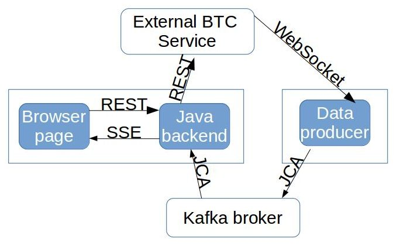

# Bitcoin monitor: a demo to show reactive capabilities of MicroProfile and Payara Micro

__This application is used as a demo in my presentation "Be Reactive and Micro with a MicroProfile Stack"__

The application uses:

- MicroProfile 1.2 API (Config, Fault Tolerance)
- Java EE 8 API (SSE, JAX-RS, JCA)
- RxJava
- React.JS
- Payara Server or Payara Micro
- Kafka Cloud Connector from Payara project
- Apache Kafka broker



# Run the demo

. **Build application with:**

  `mvn install`

. **Install and configure Apache Kafka** +
  The following instructions are for Linux, under the `root` user or with `sudo`. Similar procedure should work on other systems.

** Install https://zookeeper.apache.org/[Apache Zookeeper]
** Download Kafka from https://kafka.apache.org/downloads.html
** Unpack Kafka to `/opt/Kafka` (with `tar -xvf kafka.tgz  -C /opt/Kafka`)
** Start Kafka with:

    /opt/Kafka/bin/kafka-server-start.sh /opt/Kafka/config/server.properties

** Create a new `btctx` topic with:

   /opt/Kafka/bin/kafka-topics.sh --create --zookeeper localhost:2181 --replication-factor 1  --partitions 1 --topic btctx

. **Run the application on Payara Server** +
  __Alternatively jump to step 4 to run on Payara Micro__

** Install and run Payara Server 5.182 or newer from https://www.payara.fish
** Deploy `BTCmonitor/BTCFrontend/target/kafka-rar.rar` to the server (make sure that it's deployed with the name `kafka-rar` which should be set by default)
** Deploy `BTCmonitor/BTCFrontend/target/BTCFrontend.war`
** Deploy `BTCmonitor/BTCDataProducer/target/BTCDataProducer.war`
** Access the app in the browser by default at http://localhost:8080/BTCFrontend/

. **Run the application on Payara Micro**

** Go to `BTCmonitor/BTCFrontend/target/` and run the frontend with:

  java -jar payara-micro.jar kafka-rar.rar BTCFrontend.war

** Go to `BTCmonitor/BTCDataProducer/target/` and run the data producer with:

    java -jar payara-micro.jar --autoBindHttp kafka-rar.rar BTCDataProducer.war

** Access the app in the browser at http://localhost:8080/BTCFrontend/


# Development mode

The frontend of the application (BTCFrontend) can be developed faster without the full build and deploy cycle.

Before development, run the following in the `BTCFrontend` directory:

```
mvn -Pfastwebbuild install
```

This will keep running and will rebuild all the web resources (HTML, JS) on the fly when changed.

You also need to deploy an exploded WAR file so that the changes are picked up by Payara Server.

To apply changes in Java code, run the following in top level project to build the app. This will skip building the web resources:

```
mvn -Pfastnowebbuild install
```